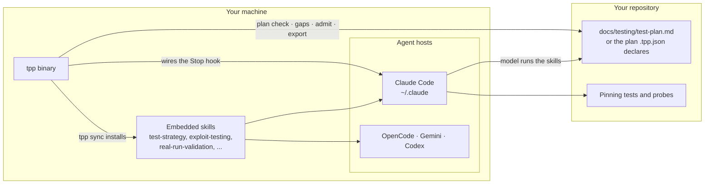
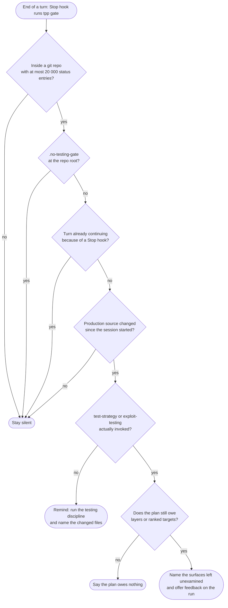
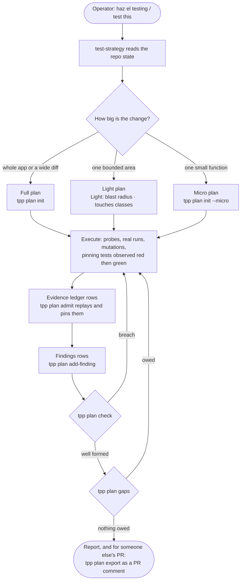
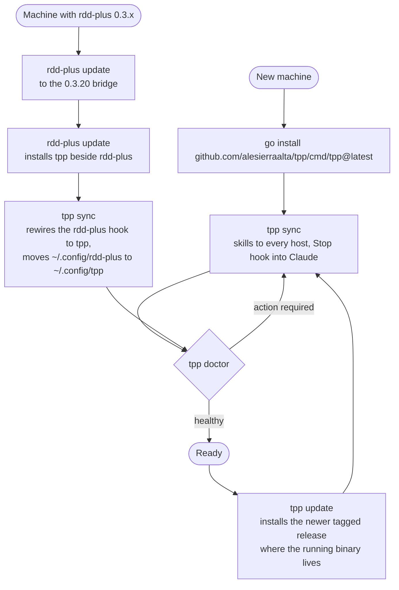

# tpp

A deterministic companion for the testing discipline in Claude Code. It complements gentle-ai; it
does not replace it. gentle-ai owns the review lifecycle (frozen candidate, refuter, receipts).
tpp owns what happens before that: a testing flow the model runs and a set of Go binaries
that keep it honest.

The split is deliberate. The model does the creative work: enumerating the classes of a contract,
imagining the inputs nobody expects, writing the probe. The binaries do the deterministic work:
installing the skills, wiring the hook that keeps them invoked, and reporting what the
environment can do so a skill degrades explicitly instead of failing on a tool it assumed.

## How it works

Four pictures of the same system: the pieces, the decision the gate takes at every Stop, the testing
flow a model runs, and how an installation stays current. The prose sections below are the
reference; these diagrams only show how the pieces fit.

### The pieces



The model does the creative work (classes of a contract, probes, pinning tests); the binary does the
deterministic work (installing, wiring, checking the plan, replaying evidence).

### What the gate decides at every Stop



It is a reminder, never an approval gate: every path exits 0, and each decision is one line in the
telemetry log.

### The testing flow a model runs



### Installing and staying current



## Install with an agent

Hand one of these prompts to an agent that has a shell. `tpp setup` does the install and the checking
itself, so the prompt only has to run it and read how it ended: exit 0 and a last line saying tpp is
installed and working.

| You use | Prompt | What you get |
|---|---|---|
| Gentle AI (gentle-ai and engram installed) | [With Gentle AI](#with-gentle-ai) | tpp's testing discipline, plus Gentle AI's native review lifecycle with receipts (RDD) after it, and Engram memory across sessions |
| Neither | [Without Gentle AI](#without-gentle-ai) | tpp's testing discipline on its own. Without gentle-ai there is no native review lifecycle and no receipts; without engram the plan file is the only memory across sessions |

tpp works the same in both: the difference is what else is on the machine, not how tpp behaves.

### Without Gentle AI

```text
Install tpp: run go install github.com/alesierraalta/tpp/cmd/tpp@latest, then tpp setup (if tpp is
not found, run "$(go env GOPATH)/bin/tpp" setup and add the PATH line it prints). It is done when
setup exits 0; show me its last lines.
```

### With Gentle AI

```text
Install tpp: run go install github.com/alesierraalta/tpp/cmd/tpp@latest, then tpp setup (if tpp is
not found, run "$(go env GOPATH)/bin/tpp" setup and add the PATH line it prints). It is done when
setup exits 0; show me its last lines. Gentle AI is already installed here: confirm setup lists
gentle-ai and engram as present.
```

## Install

```sh
go install github.com/alesierraalta/tpp/cmd/tpp@latest
tpp setup     # sync, then doctor's checks, then one line saying tpp works (exit 0) or what is left
```

`tpp setup` is the one-step path: it runs the same sync as `tpp sync`, the same checks as `tpp doctor`
against the directory it just wrote, and ends on `tpp is installed and working: <N> skills in <hosts>,
Stop hook wired to <binary>` with exit 0. A failing sync (including a machine with no host yet) stops it
with sync's exit code; a doctor problem ends it on `setup: not finished:` naming that problem, with exit 1.
When the binary's directory is not on `PATH` it prints the exact `export PATH=...` line to add; that is a
warning, not a failure, because the Stop hook calls the absolute path. Run it from the binary you intend
to keep: the hook records the path of the binary that ran it.

Step by step, for a person who wants to see each part:

```sh
tmp=$(mktemp -d)
tpp sync --config-dir "$tmp/cfg" --dry-run     # rehearse: the plan, writing nothing
tpp sync --config-dir "$tmp/cfg"               # rehearse into a throwaway Claude directory
tpp doctor --config-dir "$tmp/cfg"             # must exit 0 with verdict: healthy
tpp sync      # installs skills into every discovered host; wires the Stop hook only for Claude
tpp doctor    # verifies the install and lists optional capabilities
```

To prove the hook answers without waiting for a real session, hand the gate the payload its host would.
In a throwaway git repository with a committed file, a transcript whose first timestamp precedes the
change, and a touched production source file:

```sh
printf '%s' "{\"session_id\":\"install-check\",\"transcript_path\":\"$tmp/transcript.jsonl\",\"cwd\":\"$tmp/repo\",\"hook_event_name\":\"Stop\",\"stop_hook_active\":false}" \
  | TESTING_GATE_LOG="$tmp/gate.jsonl" tpp gate
```

It exits 0, prints a Stop payload naming the changed file, and leaves one line in `$tmp/gate.jsonl`
reading `"fired":true`. The gate always exits 0: it grades the turn and never breaks it.

`sync` installs the embedded skills into every host it finds: `~/.claude/skills`,
`~/.config/opencode/skills`, `~/.gemini/skills`, and `~/.codex/skills`. The Stop hook is wired only
where its transport is known—Claude Code's `~/.claude/settings.json`; OpenCode, Gemini, and Codex
receive skills but their transports are documented rather than wired. Claude's sync merges into
`~/.claude/settings.json`: every existing hook and setting is preserved, the gate is added once,
and running it again changes nothing. A file modified after tpp installed it is not replaced
by default; pass `--force` to replace it after tpp snapshots the edited file in the central
backup store described below. An unparseable `settings.json` aborts the run before anything is
written. Use `--config-dir` to target another Claude directory, `--hosts` to narrow installation,
and `--dry-run` to see the plan. Without an explicit `--config-dir`, commands resolve the directory
in this order: `CLAUDE_CONFIG_DIR`, then `PI_CODING_AGENT_DIR`, then `~/.claude`; empty values are
ignored, and a ledger that lives under a different directory is reached with `--config-dir`.

### Upgrading from rdd-plus

tpp (test planning process) was called rdd-plus until 0.4.0. The old names keep working, and the new
ones win when both are present:

- An rdd-plus 0.3.x install reaches tpp through `rdd-plus update`: the 0.3.20 bridge release installs
  `tpp` beside it. From then on, run `tpp`.
- `tpp sync` rewrites a Stop hook wired to `"<dir>/rdd-plus" gate` into `"<dir>/tpp" gate`, with no
  duplicate entry; `tpp uninstall` removes either.
- The first run moves `~/.config/rdd-plus` (state, backups, update cache) to `~/.config/tpp`; if the
  move fails, the old directory stays in use.
- `.rdd-plus.json` is still read when `.tpp.json` is absent; a repository carrying both is refused
  until one is removed. tpp never renames your file.
- `RDD_PLUS_HOME` and `RDD_PLUS_UPDATE_BASE_URL` are read when `TPP_HOME` and `TPP_UPDATE_BASE_URL`
  are unset.
- The OpenCode and Pi snippets are copies, not managed files: re-copy `assets/hosts/opencode/tpp.ts`
  and the `tpp gate` hook from `assets/hosts/pi/settings.stop-hook.json`.

### State and safety

Keep the local state at `<config root>/state.json`; the default is `~/.config/tpp/state.json`,
and `TPP_HOME` overrides it. It records installed hosts, components, and files. Keep it local-only.
Classify paths as managed (installed by tpp), modified-by-the-user (never overwrite without
`--force`; always snapshot first), or foreign (never write or delete). Store backups at
`<config root>/backups/<timestamp>/{manifest.json, files/…}`.

Opt into feedback with `tpp feature enable feedback`. Use `--preview` to see one anonymized
record and the two local-only files never publishable. While feedback is off, `feedback --file`
refuses and the Stop hook stops offering it. The interactive TUI now exists as `tpp tui`,
and the lifecycle commands `update`, `uninstall`, `restore`, and `repair` are documented in the
Commands table below.

## Commands

| Command | What it does |
|---|---|
| `tpp gate` | The Stop hook. Reads the hook payload on stdin, decides, logs one line, and emits Stop feedback when a session changed production source without loading the adversarial testing discipline. Always exits 0. |
| `tpp setup [--hosts <a,b>] [--config-dir <dir>]` | Installs and verifies in one step: the same sync as `tpp sync`, the same checks as `tpp doctor` on the directory it wrote, and a PATH check that prints the `export PATH=...` line when the binary's directory is missing. Ends on `tpp is installed and working: ...` with exit 0, or exits with sync's code or 1 (`setup: not finished: ...`). |
| `tpp sync [--dry-run] [--force]` | Installs the embedded skills into discovered hosts and wires Claude's Stop hook. `--dry-run` prints the plan and writes nothing; `--force` replaces modified managed files after snapshotting them. Idempotent. |
| `tpp doctor` | Reports installed skills (and whether they drift from the embedded version), whether the hook is wired, and which optional tools are on PATH with what degrades without each. `--json` for machines. Exit 1 when git, a skill, or the hook is missing. |
| `tpp status [--json]` | Reports local installation state, features, and available version — the cached result after `update` has checked, or `unknown (no update check yet)` before the first check. |
| `tpp feature list\|enable\|disable <id> [--preview]` | Lists or toggles optional features; preview without changing state. |
| `tpp tui` | Interactive menu over the status report, feature toggles (list, enable/disable, preview), and the sync dry-run plan. Needs an interactive terminal on Linux or macOS; elsewhere it refuses and points at `status`, `feature`, and `sync --dry-run`. |
| `tpp update [--check]` | Checks the Go module proxy for a newer release and installs it with `go install github.com/alesierraalta/tpp/cmd/tpp@<tag>` (prints the command when `go` is absent); `--check` only refreshes the offline cache. |
| `tpp uninstall [--dry-run] [--orphans] [--force] [--config-dir <dir>]` | Removes managed assets and unwires the Stop hook; never touches foreign files. Modified content needs `--force` (snapshot first); `--orphans` also removes assets the manifest no longer ships; `--dry-run` writes nothing. |
| `tpp restore [--id <backup-id>] [--dry-run]` | Copies a backup store entry back onto its original paths (default: the latest backup). |
| `tpp repair [--config-dir <dir>] [--dry-run] [--force]` | Brings a broken install back to what `doctor` reports healthy (missing/drifted managed skills and Stop hook re-wire); a healthy install is a no-op. |
| `tpp plan` | Writes the plan skeleton, checks the contract, names the breadth still owed, and records one Findings row from flags. `add-finding` writes that row only: it refuses a row the checker would reject and never writes an evidence row. |
| `tpp plan admit` | Reads the plan's Evidence ledger and decides every row. A dry run by default: `--execute` runs each admitted row's one command through `sh -c` twice, so a pin is only recorded over an output that held still, `--sandbox` observes it in a container with the tree mounted read-only and no network (it needs docker, and the default image is pulled on first use) and replays a declared `Mutate` edit against a writable copy of the tree, where the command must go red under the edit and green once the file is put back (a cell may hold a survey of edits separated by ` ;; `, each replayed on its own copy; an edit prefixed `~ ` is declared equivalent and must stay green, or the row is refused as `mutation-not-equivalent`; an admitted survey prints `N killed, M equivalent`; an edit whose own text contains ` ;; ` cannot be expressed), a row whose `Expect` cell is `fail` pins a test observed red (only an exit from 1 to 125 qualifies, so a missing command (127) is never pinned as red; a zero exit is refused as `expected-failure-passed`), `--only <ids>` narrows the run, `--timeout` bounds one command, and `--record <ids>` writes the observed digest into the plan together with the mode it was observed in. Exit 1 when a row is refused. |
| `tpp plan export [--path <plan>] [--commit <sha>]` | Prints the plan's Findings as Markdown for a pull request comment: one row per finding with its location, severity, status, pinning test and the evidence that re-observes it (the Admit command, the digest shortened to 12 hex, and `Expect: fail` when declared), headed by the commit covered (default the short HEAD) and the plan's base name, never its directory. Every cell is sanitised like the gaps report's quotes. It never posts: `tpp plan export --path <plan> \| gh pr comment <n> -F -` is the operator's call. |
| `tpp feedback` | Records one honest process report about the testing method itself, or reads the reports back. `--template` prints a fillable skeleton, `--file <path>` records it, `--summary` (the default) answers whether the method is earning its keep. |
| `tpp version` | Prints the version. |

## How the gate decides

At the end of every turn the gate fires only when all of these hold:

- the working directory is inside a git repository with at most 20 000 status entries (a home
  directory has hundreds of thousands; a project never does);
- at least one production source file changed after the session started, where the session start
  is the first `timestamp` in the session transcript and production source means a source
  extension outside test, fixture, vendored, build, and Claude configuration trees;
- neither `test-strategy` nor `exploit-testing` was actually invoked in the session (a name in the
  available-skills listing does not count; a Skill call or a read of its `SKILL.md` does);
- the repository has no `.no-testing-gate` file at its root;
- the turn is not already continuing because of a previous Stop hook.

When it fires, the feedback names the files and asks for `test-strategy` ("haz el testing").
It is a reminder, not an approval gate.

Telemetry: every decision appends one JSON line to `~/.claude/telemetry/testing-gate.jsonl`
(override with `TESTING_GATE_LOG`), so the invocation rate is measurable over time. Its `repo`, `session`
and `plan` fields are pseudonyms, not names.

## Skills

The embedded skills live under `assets/skills/`. `test-strategy` is the organic entry point
("haz el testing"): it infers the mode from repository state, persists a plan that never
shrinks, sweeps the specialized skills for their own checks, and executes through
`exploit-testing`, whose ladder climbs from contract classes and hostile inputs to real
collaborators, real seams, injected faults, and concurrency. Every finding carries an executed
evidence record; anything not executed is a hypothesis.

`breakcheck` is an explicitly invoked bounded adversarial campaign for one candidate between the Verifier and RDD; it reports evidence and a readiness disposition, not a score.

## Development

```sh
go test ./...           # unit, integration (real git repositories), and differential tests
go run ./tools/mutants  # 23 literal mutants on the gate; every one must be killed
make build              # bin/tpp
```

Integration tests build the CLI once and drive it with real repositories in temporary
directories; they are skipped under `-short`. The differential test compares the Go gate with the
original Node hook when `node` and `~/.claude/hooks/testing-gate.mjs` are present.

CI runs that suite on every pull request and on every push to `master`, with `node` installed so the
benchmark's JavaScript cases run instead of skipping. It checks `gofmt`, `go vet`, the build and
`go test ./... -count=1` — the same commands `make vet`, `make build` and `make test` run locally.

## Pending

- The eval harness (`assets/skills/test-strategy/evals/run_evals.py`, `selftest.py`) and the
  calibration tools (`assets/skills/test-strategy/assets/seed-mutants.py`, `fingerprint.sh`) are
  still Python and shell. They will become subcommands.
- Replaying a ledger row's mutation before a finding is accepted, and `status --next-transition`,
  are the next binaries.

## Plan

The structure of `docs/testing/test-plan.md` is a contract, and deriving it from prose every
session is where compliance goes wrong: in one 15-case benchmark, three runs wrote their findings
as prose sections instead of the template's tables, and every one of those had never opened the
template.

For both `check` and `plan`, a relative `--path` is resolved against the worktree root. An absolute
`--path` is taken as given, except in `check`, which refuses it as a usage error. This is the same
relative resolution and containment rule used for the `planPath` declaration in `.tpp.json`.

The effective plan path follows one precedence rule: an explicit `--path` wins, then `planPath` in
`.tpp.json` at the worktree root, then `docs/testing/test-plan.md`. Declare a scoped plan like
this:

```json
{"planPath": "docs/testing/test-plan-redis-stream-pool.md"}
```

A malformed, unreadable or unusable declaration fails closed; it never silently falls back to the
default. `tpp check`, the Stop-hook gate and every `plan *` command honor the same declaration.

```
tpp plan init                # write the skeleton, tables and all; never overwrites silently
tpp plan check               # exit 1 and name every breach of the contract
tpp plan add-finding ...     # write one Findings row; refuses a row the checker would reject
```

`check` reports a Findings section that is not a table, a finding that cites no `path:line`, a
finding citing an evidence id that is not in the ledger, a settled finding that names no pinning
test, a `razonado` row sitting in the evidence ledger, and an `n/a` layer row without a reason in
its `Scope` cell when the plan declares `Light:`. It says nothing about whether the testing was
good; it says the plan can be located, honoured, and re-scored.

A plan may declare itself scoped. A bounded change — one target inside one or two files, touching
none of the classes the skill's boundary list forbids — plans its blast radius instead of the whole
app, and says so in one header line: `Light: <blast radius> · touches <classes>`. Every layer the
run did not touch keeps its row with status `n/a` and states why in the `Scope` cell, and the "Not
testing, on purpose" table names what a full run would have added. Execution is unchanged: the
target climbs to its target rung through its sibling, every confirmed finding leaves a pinning test
and an evidence row, and the run closes on `plan check`. The declaration is the half a binary can
check; whether the change was really bounded stays with the run and the plan's reader.

## Hosts

The decisions live in Go; only the transport is per host. That split is what lets the same rules
serve more than one agent, and it is why `check` exists:

```
tpp check          # exit 1 and say what this repository owes, from git and the plan alone
```

It reads no hook payload, no transcript and no host configuration, so anything that can run a
command can use it: another agent, a Makefile, a pre-push script, CI. What a host integration adds
on top is knowing what THIS session did, which the repository cannot tell you.

| Host | Status |
|---|---|
| Claude Code | verified: `sync` wires the Stop hook, `gate` reads its payload and answers in its schema, `doctor` runs the wired command and requires exit zero |
| Anything that runs a command | verified: `check`, `plan init`, `plan check`, `plan gaps` need no host at all |
| Gemini CLI | not implemented: its `settings.json` takes command hooks under different event names, and its payload and output schemas are not verified here |
| Codex, OpenCode, Pi | not implemented: each has its own extension surface, and guessing a payload schema would ship a hook that silently never fires |

Nothing above is a promise about a host that is not listed as verified. A hook that looks wired and
never answers is the failure this project keeps finding, so a host counts as supported when its
command has been run and its exit code checked, not when its configuration file has been written.

## The two questions at the Stop

The gate asks one question when a session changed production source and never loaded the
discipline: run it. It asks a different one when the discipline ran and stopped halfway.

Covering a diff and reporting as though the surface were covered is the failure that survives
every green check: the depth work succeeds, the breadth work is never started, and the summary
reads as complete. The plan makes it detectable, because a layer the plan assigned carries an
owner and a status: `Security | appsec-adversarial-auditor | ... | pending` after the run means
assigned and never invoked.

```
tpp plan gaps                # exit 1 and name every layer still owed, with its owner
```

`plan gaps` reads the layer matrix's status cells. A row counts as swept when its status reads
`done`, `fixed` or `closed`, and `n/a`, `na`, `none` and `skipped` leave the denominator entirely:
marking a layer out of scope is a decision the plan records, not a silent omission. The `Skill`
cell only labels the rows still owed, so a row with no owner still has to be swept.

Nothing verifies that an assigned sibling was really invoked — the cell is what the check has, and
that is deliberate, because the check must run with no host and no transcript. So the routing
ledger in the reply says how each sibling ran: through a Skill tool, or `inline: <path to its
SKILL.md>` where the harness has none. Without that line an inline run and a skipped one look
identical in the plan.

At the Stop the same check runs by itself. The model is told which surfaces went unexamined and
asked to say so plainly in its final message rather than let depth read as coverage, and the
operator gets one line in their own terminal offering feedback on the run, so the offer does not
depend on the model remembering to make it. It is a reminder, not an approval gate, and a
`.no-testing-gate` file silences it.

## Run feedback

The most valuable artifact a run can hand back is an honest report on the method itself: what
paid off, what was ceremony, where a rule had to be reverse-engineered, and whether it earned its
keep. The gate offers it at every Stop; `feedback` is where the answer lands. At the end of a beta run—
including blocked or partial runs—the executing agent records its own retrospective. The reply carries
only a brief acknowledgment after a successful write; the summary groups by project and names any
verdict it could not classify.

```sh
tpp feedback --template          # a fillable skeleton with the run's identity already filled
tpp feedback --file report.md    # record one report; refusals exit 2 and write nothing
tpp feedback --summary           # counts per verdict and per skill version, plus the guesses
tpp feedback                     # no flags: the summary, the cheapest path to the answer
```

One report is `paid`, `cost`, `reason`, and a `verdict` of `paid`, `partly`, or `ceremony`; `guess`
and `freeform` are optional. The `skill` field names what actually ran as `<name>` or `<name> <version>`; for example, a breakcheck run records `breakcheck <its version>`. Each report appends one JSON line to
`<config-dir>/telemetry/run-feedback.jsonl` and one section to `run-feedback.md`, beside the gate's
own log. The summary counts reports, verdicts, and skill versions and prints the `guess` lines of
the most recent reports; it clusters nothing and invents no score.

### Sanitization

Before writing, identity values become stable per-installation pseudonyms so runs of the same target
still compare. Free text loses the project-specific instance while keeping what the method did. A
secret in `paid`, `cost`, or `reason` refuses the whole report and writes nothing; in `guess` or
`freeform`, it is redacted. New rows carry `"sanitized":true`. The local-only files
`<config-dir>/telemetry/.salt` and `<config-dir>/telemetry/.pseudonyms.jsonl` must never be published:
the first reverses every pseudonym and the second maps them back to names. Rows written before this
stage existed keep their old shape and are counted in the summary.

The same project is not correlated across the two ledgers: the feedback ledger seals the absolute
worktree root, while the gate ledger seals the repository directory name.

## Benchmark

`tpp bench` measures whether the testing skill finds defects it was never told about. Each
case under `bench/cases/<id>/` is a fixture project whose own suite is green plus a sealed
`KEY.json` listing the planted defects (file, line, class, keywords, trigger). The key is never
copied into a workspace.

```
tpp bench run --cases 'bench/cases/*' --model sonnet --runs 1 --max-cost-usd 20
tpp bench score --case bench/cases/<id> --workspace <ws>     # re-score after grader changes
tpp bench history                                            # every run, never rewritten
tpp bench rescore bench/results/<run>                        # re-read a finished run with today's rules
tpp bench compare bench/results/<before> bench/results/<after>   # per-case reported and caught, side by side
```

`bench run` scaffolds `<out>/<case>/<run>/ws` (default `bench/results/<timestamp>/`), commits the
fixture, checks its suite is green (otherwise the case is invalid and skipped), spawns
`claude -p "haz el testing"` in it, then scores `docs/testing/test-plan.md`:

Two measures per planted defect, because saying it and catching it are different claims.

**Reported** reads `docs/testing/test-plan.md`: a defect is found when a Findings row cites its
file (suffix match, so `render.js:9` and `fixture/src/render.js` both name `src/render.js`) and
either a line within ±5 of the planted line or one of its keywords. The row must cite an id that
exists in the Evidence ledger; an unlinked row is prose and does not count, and an empty ledger
makes every citation dangling. The file and line may come from the linked ledger rows, the
keyword only from the finding itself. A row matching no planted defect is a **false positive**.

**Caught** ignores the plan and asks whether the tests distinguish broken code from correct code.
Each case ships `fix/all/` (every defect fixed) and, when it has more than one, `fix/keep-<ID>/`
(every defect but that one fixed). The test files the agent added or changed are carried onto each
variant and run per test: a test green on `fix/all` and red on `fix/keep-D` catches D. A test red
on `fix/all` is broken or written to another API, so it is ignored and counted separately; a test
green everywhere catches nothing.

**Pinned** reads the plan's `Pinning test` cell: it counts defects whose finding names a test that
holds them. Naming a test and having one that distinguishes the defect are different claims, so
pinned sits next to caught, never instead of it. Plans written before rule 13 have no such column
and simply claim nothing.

The gap between the columns is the interesting number. A run can report a defect it never
pinned with a test, or catch one it never wrote down.

Per run: `result.json` and the `test-plan.md` it produced, kept even when the workspace is
removed. Per bench: `aggregate.json`, `summary.md`, one line in `bench/history.jsonl` and one row
in `bench/history.md` with the installed `test-strategy` version, so skill versions compare on
identical fixtures. `--dry-run` scaffolds and checks fixtures without spawning or recording;
`--max-cost-usd` stops early with exit code 2; a run with any failed or invalid case exits 3, so a
partial number is never read as a corpus result.

The Pi runner (`--runner pi`, the default) measures the same cases with Pi itself:
`pi -p "haz el testing" --mode json --model <provider>/<model>[:<thinking>] --no-session`, spawned in
the workspace with `PI_CODING_AGENT_DIR` pointed at a throwaway agent directory. That directory holds
the same embedded skills and a `settings.json` that loads no packages, so the operator's extensions,
memory protocol, and MCP servers stay out of the reading. `--model` is optional: Pi defaults to
`opencode/muse-spark-1.3-contributor-free`, while the `claude` runner takes a bare name and defaults
to `haiku`. Pi has no turn cap, so `--timeout` is its only wall-clock limit. `--runner` defaults to
`pi`; `claude` stays as the last-resort alternative for when Pi's providers are unavailable, and every
reading already in the history still names the runner and the model it used.

The Pi agent directory copies `auth.json` and `models-store.json`; it never links them. The Claude
throwaway config linked the operator's credentials, and a refresh that failed wrote the empty token
state straight through the link, logging the operator out of Claude Code everywhere (F25 in
`docs/testing/test-plan.md`). A copy confines that failure to a file the run throws away, and a test
holds the line: the copy is a regular file, not a link, and the source still holds its token
afterwards. When the operator has no `auth.json`, the run is not stopped: it says so and lets the CLI
report the authentication error itself, as a failed case.

## License

Apache-2.0. See `LICENSE` and `NOTICE` for the attribution of the skills derived from the
Gentleman-Programming skills.
